# Build Architecture

This document describes the Docker multi-stage build architecture used in this repository.

## Overview

The Dockerfile uses a multi-stage build approach to:
- Compile Rust code for both native and WebAssembly targets
- Build and test OpenFeature providers (JavaScript and Java)
- Run integration tests with example hosts (Node.js, Java, Go, Python)
- Package artifacts for distribution

## Build Stage Diagram

The diagram below shows all build stages and their dependencies:

```mermaid
flowchart TD
    %% Base images
    alpine[alpine:3.22]
    node[node:20-alpine]
    java[eclipse-temurin:21-alpine]
    go[golang:1.23-alpine]
    python[python:3.11-slim]
    temurin17[eclipse-temurin:17-jdk]

    %% Base stages
    alpine --> rust-base[rust-base<br/>Rust toolchain + protoc]
    node --> openfeature-provider-js-base[openfeature-provider-js-base<br/>Node deps + proto gen]
    node --> node-host-base[node-host-base<br/>Example host]
    java --> java-host-base[java-host-base<br/>Example host]
    go --> go-host-base[go-host-base<br/>Example host]
    python --> python-host-base[python-host-base<br/>Example host]
    temurin17 --> openfeature-provider-java-base[openfeature-provider-java-base<br/>Java provider base]

    %% Dependency compilation
    rust-base --> rust-deps[rust-deps<br/>Cached Rust dependencies]
    rust-deps --> wasm-deps[wasm-deps<br/>WASM-specific deps]

    %% Test stages for native Rust
    rust-deps --> confidence-resolver.test[confidence-resolver.test<br/>✓ Core resolver tests]
    rust-deps --> wasm-msg.test[wasm-msg.test<br/>✓ WASM msg tests]

    %% Lint stages for native Rust
    rust-deps --> confidence-resolver.lint[confidence-resolver.lint<br/>⚡ Core resolver lint]
    rust-deps --> wasm-msg.lint[wasm-msg.lint<br/>⚡ WASM msg lint]

    %% WASM build and lint
    wasm-deps --> wasm-rust-guest.build[wasm-rust-guest.build<br/>🔨 Build WASM resolver]
    wasm-deps --> wasm-rust-guest.lint[wasm-rust-guest.lint<br/>⚡ WASM guest lint]
    wasm-deps --> confidence-cloudflare-resolver.lint[confidence-cloudflare-resolver.lint<br/>⚡ Cloudflare lint]

    %% WASM artifact
    wasm-rust-guest.build --> wasm-rust-guest.artifact[wasm-rust-guest.artifact<br/>📦 confidence_resolver.wasm]

    %% Host integration tests
    node-host-base --> node-host.test[node-host.test<br/>✓ Node host integration]
    java-host-base --> java-host.test[java-host.test<br/>✓ Java host integration]
    go-host-base --> go-host.test[go-host.test<br/>✓ Go host integration]
    python-host-base --> python-host.test[python-host.test<br/>✓ Python host integration]
    wasm-rust-guest.artifact -.-> node-host.test
    wasm-rust-guest.artifact -.-> java-host.test
    wasm-rust-guest.artifact -.-> go-host.test
    wasm-rust-guest.artifact -.-> python-host.test

    %% OpenFeature JS provider
    openfeature-provider-js-base --> openfeature-provider-js.build[openfeature-provider-js.build<br/>🔨 TypeScript build]
    wasm-rust-guest.artifact -.-> openfeature-provider-js-base
    openfeature-provider-js-base --> openfeature-provider-js.test[openfeature-provider-js.test<br/>✓ Provider tests]
    openfeature-provider-js.test --> openfeature-provider-js.test_e2e[openfeature-provider-js.test_e2e<br/>✓ E2E tests]
    openfeature-provider-js.build --> openfeature-provider-js.pack[openfeature-provider-js.pack<br/>📦 npm pack]
    openfeature-provider-js.pack --> openfeature-provider-js.artifact[openfeature-provider-js.artifact<br/>📦 package.tgz]

    %% OpenFeature Java provider
    openfeature-provider-java-base --> openfeature-provider-java.test[openfeature-provider-java.test<br/>✓ Java provider tests]
    openfeature-provider-java-base --> openfeature-provider-java.build[openfeature-provider-java.build<br/>🔨 Maven build]
    openfeature-provider-java.build --> openfeature-provider-java.publish[openfeature-provider-java.publish<br/>🚀 Maven Central]
    wasm-rust-guest.artifact -.-> openfeature-provider-java-base

    %% All stage aggregates everything
    wasm-rust-guest.artifact --> all[all<br/>✅ Complete build]
    confidence-resolver.test --> all
    wasm-msg.test --> all
    openfeature-provider-js.test --> all
    openfeature-provider-js.test_e2e --> all
    openfeature-provider-java.test --> all
    node-host.test --> all
    java-host.test --> all
    go-host.test --> all
    python-host.test --> all
    confidence-resolver.lint --> all
    wasm-msg.lint --> all
    wasm-rust-guest.lint --> all
    confidence-cloudflare-resolver.lint --> all
    openfeature-provider-js.build --> all
    openfeature-provider-java.build --> all

    %% Styling
    classDef baseImage fill:#e1f5ff,stroke:#0066cc
    classDef buildStage fill:#fff4e1,stroke:#ff8c00
    classDef testStage fill:#e8f5e9,stroke:#2e7d32
    classDef lintStage fill:#fff3e0,stroke:#f57c00
    classDef artifact fill:#f3e5f5,stroke:#7b1fa2
    classDef publish fill:#ffebee,stroke:#c62828
    classDef final fill:#c8e6c9,stroke:#388e3c

    class alpine,node,java,go,python,temurin17 baseImage
    class rust-base,openfeature-provider-js-base,node-host-base,java-host-base,go-host-base,python-host-base,openfeature-provider-java-base,rust-deps,wasm-deps baseImage
    class wasm-rust-guest.build,openfeature-provider-js.build,openfeature-provider-java.build buildStage
    class confidence-resolver.test,wasm-msg.test,node-host.test,java-host.test,go-host.test,python-host.test,openfeature-provider-js.test,openfeature-provider-js.test_e2e,openfeature-provider-java.test testStage
    class confidence-resolver.lint,wasm-msg.lint,wasm-rust-guest.lint,confidence-cloudflare-resolver.lint lintStage
    class wasm-rust-guest.artifact,openfeature-provider-js.pack,openfeature-provider-js.artifact artifact
    class openfeature-provider-java.publish publish
    class all final
```



**Legend:**
- 🔨 Build stages compile code
- ✓ Test stages run unit/integration tests
- ⚡ Lint stages run code quality checks
- 📦 Artifact stages extract build outputs
- 🚀 Publish stages deploy to registries
- ✅ Final `all` stage aggregates everything

## Key Features

### Dependency Caching
Rust dependencies are compiled once in the `rust-deps` stage and reused across all subsequent builds. This significantly speeds up incremental builds.

### Parallel Execution
Test and lint stages are independent and can run concurrently, reducing total build time.

### WASM Artifact Sharing
The core `confidence_resolver.wasm` is built once in `wasm-rust-guest.build` and shared across:
- All host examples (Node.js, Java, Go, Python)
- OpenFeature JavaScript provider
- OpenFeature Java provider

### Targeted Builds
You can build specific components using Docker's `--target` flag:

```bash
# Build only the WASM artifact
docker build --target=wasm-rust-guest.artifact .

# Build and extract the npm package
docker build --target=openfeature-provider-js.artifact .

# Run only JavaScript provider tests
docker build --target=openfeature-provider-js.test .

# Build everything (default)
docker build .
```

## Stage Descriptions

### Base Stages

- **rust-base**: Installs Rust toolchain, protoc, and build dependencies
- **openfeature-provider-js-base**: Node.js environment with dependencies and proto generation
- **node-host-base**, **java-host-base**, **go-host-base**, **python-host-base**: Example host environments
- **openfeature-provider-java-base**: Java provider environment with Maven

### Dependency Stages

- **rust-deps**: Compiles all Rust dependencies (cached layer)
- **wasm-deps**: Extends rust-deps with WASM-specific dependencies

### Build Stages

- **wasm-rust-guest.build**: Compiles Rust resolver to WebAssembly
- **openfeature-provider-js.build**: Compiles TypeScript to JavaScript
- **openfeature-provider-java.build**: Builds Java provider with Maven

### Test Stages

- **confidence-resolver.test**: Unit tests for core resolver
- **wasm-msg.test**: Tests for WASM messaging layer
- **openfeature-provider-js.test**: Unit tests for JavaScript provider
- **openfeature-provider-js.test_e2e**: End-to-end tests (requires credentials)
- **openfeature-provider-java.test**: Tests for Java provider
- **node-host.test**, **java-host.test**, **go-host.test**, **python-host.test**: Integration tests

### Lint Stages

- **confidence-resolver.lint**: Clippy checks for core resolver
- **wasm-msg.lint**: Clippy checks for WASM messaging
- **wasm-rust-guest.lint**: Clippy checks for WASM guest
- **confidence-cloudflare-resolver.lint**: Clippy checks for Cloudflare resolver

### Artifact Stages

- **wasm-rust-guest.artifact**: Extracts `confidence_resolver.wasm`
- **openfeature-provider-js.pack**: Creates npm package tarball
- **openfeature-provider-js.artifact**: Extracts package.tgz for distribution

### Publish Stages

- **openfeature-provider-java.publish**: Publishes Java provider to Maven Central (requires secrets)

### Aggregation Stage

- **all**: Default stage that ensures all tests, lints, and builds complete successfully

## CI/CD Integration

The build stages are used in GitHub Actions workflows:

- **release-please.yml**: Publishes packages when releases are created
  - Uses `openfeature-provider-js.artifact` to extract npm package
  - Uses `openfeature-provider-java.publish` to deploy to Maven Central

## Docker Build Cache

The repository uses Docker layer caching to speed up builds in CI:

```yaml
cache-from: type=registry,ref=ghcr.io/${{ github.repository }}/cache:main
```

This allows GitHub Actions to reuse layers from previous builds.
