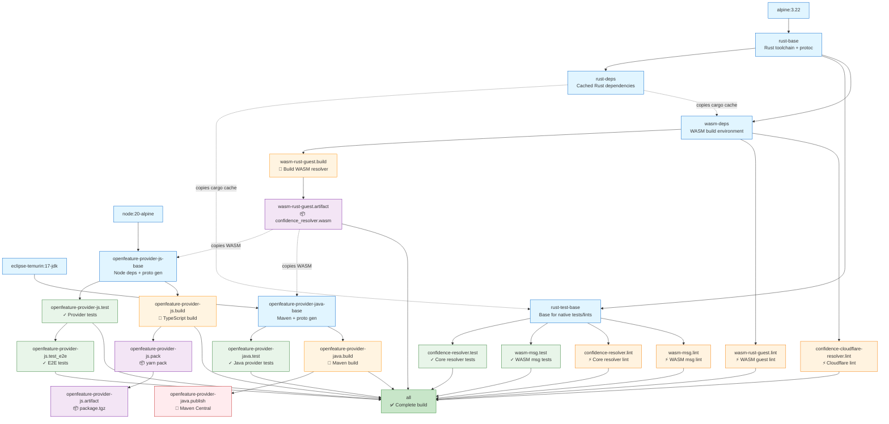

# Build Architecture

This document describes the Docker multi-stage build architecture used in this repository.

## Overview

The Dockerfile uses a multi-stage build approach to:
- Compile Rust code for both native and WebAssembly targets
- Build and test OpenFeature providers (JavaScript and Java)
- Package artifacts for distribution

## Build Stage Diagram

The diagram below shows all build stages and their dependencies:



**Legend:**
- 🔨 Build stages compile code
- ✓ Test stages run unit/integration tests
- ⚡ Lint stages run code quality checks
- 📦 Artifact stages extract build outputs
- 🚀 Publish stages deploy to registries
- ✅ Final `all` stage aggregates everything

## Key Features

### Dependency Caching
Rust dependencies are compiled once in the `rust-deps` stage and reused across all subsequent builds. This significantly speeds up incremental builds.

### Parallel Execution
Test and lint stages are independent and can run concurrently, reducing total build time.

### WASM Artifact Sharing
The core `confidence_resolver.wasm` is built once in `wasm-rust-guest.build` and shared across:
- OpenFeature JavaScript provider
- OpenFeature Java provider

### Targeted Builds
You can build specific components using Docker's `--target` flag:

```bash
# Build only the WASM artifact
docker build --target=wasm-rust-guest.artifact .

# Build and extract the npm package
docker build --target=openfeature-provider-js.artifact .

# Run only JavaScript provider tests
docker build --target=openfeature-provider-js.test .

# Build everything (default)
docker build .
```

## Stage Descriptions

### Base Stages

- **rust-base** (FROM alpine:3.22): Installs Rust toolchain via rustup, protoc, and build dependencies
- **rust-deps** (FROM rust-base): Compiles all Rust workspace dependencies (cached layer for faster rebuilds)
- **rust-test-base** (FROM rust-base): Copies dependency cache and source code for native testing/linting
- **wasm-deps** (FROM rust-base): Copies dependency cache and source code for WASM builds
- **openfeature-provider-js-base** (FROM node:20-alpine): Node.js environment with Yarn, dependencies, and proto generation
- **openfeature-provider-java-base** (FROM eclipse-temurin:17-jdk): Java environment with Maven and proto files

### Test Stages

- **confidence-resolver.test** (FROM rust-test-base): Unit tests for core resolver
- **wasm-msg.test** (FROM rust-test-base): Tests for WASM messaging layer
- **openfeature-provider-js.test** (FROM openfeature-provider-js-base): Unit tests for JavaScript provider
- **openfeature-provider-js.test_e2e** (FROM openfeature-provider-js.test): End-to-end tests (requires credentials via Docker secret)
- **openfeature-provider-java.test** (FROM openfeature-provider-java-base): Tests for Java provider

### Lint Stages

- **confidence-resolver.lint** (FROM rust-test-base): Clippy checks for core resolver
- **wasm-msg.lint** (FROM rust-test-base): Clippy checks for WASM messaging
- **wasm-rust-guest.lint** (FROM wasm-deps): Clippy checks for WASM guest
- **confidence-cloudflare-resolver.lint** (FROM wasm-deps): Clippy checks for Cloudflare resolver

### Build Stages

- **wasm-rust-guest.build** (FROM wasm-deps): Compiles Rust resolver to WebAssembly (wasm32-unknown-unknown target)
- **openfeature-provider-js.build** (FROM openfeature-provider-js-base): Compiles TypeScript to JavaScript
- **openfeature-provider-java.build** (FROM openfeature-provider-java-base): Builds Java provider with Maven

### Artifact Stages

- **wasm-rust-guest.artifact** (FROM scratch): Extracts `confidence_resolver.wasm` (rust_guest.wasm → confidence_resolver.wasm)
- **openfeature-provider-js.pack** (FROM openfeature-provider-js.build): Creates npm package tarball via `yarn pack`
- **openfeature-provider-js.artifact** (FROM scratch): Extracts package.tgz for distribution

### Publish Stages

- **openfeature-provider-java.publish** (FROM openfeature-provider-java.build): Publishes Java provider to Maven Central (requires GPG and Maven secrets)

### Aggregation Stage

- **all** (FROM scratch): Default stage that ensures all tests, lints, and builds complete successfully by copying marker files

## CI/CD Integration

The build stages are used in GitHub Actions workflows:

- **release-please.yml**: Publishes packages when releases are created
  - Uses `openfeature-provider-js.artifact` to extract npm package
  - Uses `openfeature-provider-java.publish` to deploy to Maven Central

## Docker Build Cache

The repository uses Docker layer caching to speed up builds in CI:

```yaml
cache-from: type=registry,ref=ghcr.io/${{ github.repository }}/cache:main
```

This allows GitHub Actions to reuse layers from previous builds.

## Dependency Flow

The `rust-deps` stage builds dummy source files to compile all workspace dependencies, creating a cached layer. This cache is then copied into:
- `rust-test-base` (for native tests and lints)
- `wasm-deps` (for WASM builds)

This approach ensures dependencies are only compiled once, even when building multiple targets.
