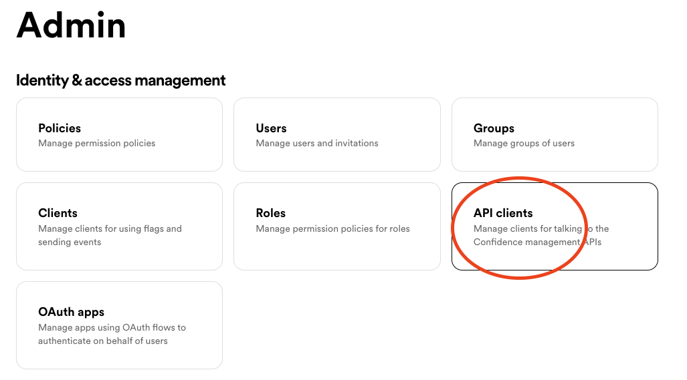
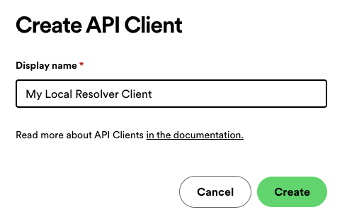
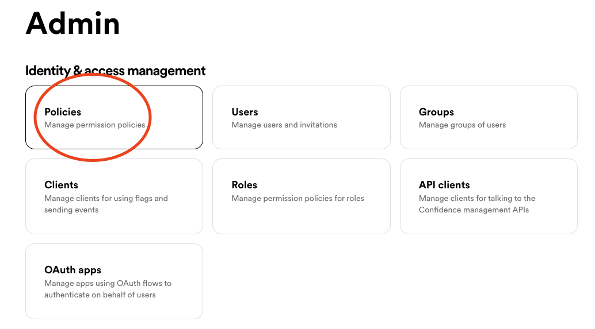
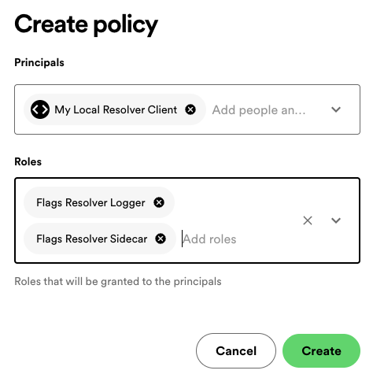
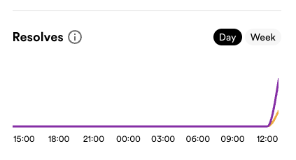
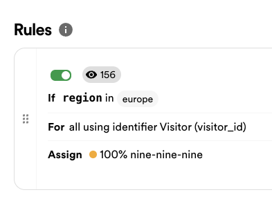

# Guide on migration from "online" provider to Local provider

This should guide you from moving from `@spotify-confidence/openfeature-server-provider` ([repo](https://github.com/spotify/confidence-sdk-js/blob/main/packages/openfeature-server-provider)) to `@spotify-confidence/openfeature-server-provider-local` ([repo](https://github.com/spotify/confidence-resolver/tree/main/openfeature-provider/js)).

## Dependencies

Simply switch out your version of `@spotify-confidence/openfeature-server-provider` to the latest version of `@spotify-confidence/openfeature-server-provider-local`.

The dependencies to Openfeature (`@openfeature/server-sdk` & `@openfeature/core`) should remain intact.

## Constructing

Where you previously used either type of approaches to construct your Confidence open feature provider:
```ts
const provider = createConfidenceServerProvider({
  clientSecret: 'your-client-secret',
  fetchImplementation: fetch,
  timeout: 1000,
});

// or
const confidenceInstance: Confidence // created separately
const provider = createConfidenceServerProvider(confidenceInstance);
```

### The new constructor has two new required options:

```ts
import { createConfidenceServerProvider } from '@spotify-confidence/openfeature-server-provider-local';

const provider = createConfidenceServerProvider({
  flagClientSecret: 'your-client-secret', // this is the same client secret as before
  apiClientId: process.env.CONFIDENCE_API_CLIENT_ID!, // <----- New and mandatory!
  apiClientSecret: process.env.CONFIDENCE_API_CLIENT_SECRET!, // <-----  New and mandatory!
  // initializeTimeout?: number
  // flushInterval?: number
  // fetch?: typeof fetch (Node <18 or custom transport)
});
```

## Usage
Since this is just another Provider meant to be used with the OpenFeature SDK; the integration when accessing flag values remain the same.

## Obtaining the new credentials

`CONFIDENCE_API_CLIENT_ID` and `CONFIDENCE_API_CLIENT_SECRET` are credentials for a Confidence API Client with some specific security policies applied.

Someone with admin access in your confidence workspace can generate a new API client like this:

**1. Access the API clients in the Confidence Admin Panel.**



**2. Create a new API client and name it well:**



**3. Store the API client ID and API client secret in a safe place**

The credentials need to be accessible from your application, for example as environment variables.

**4. Navigate to Policies in the Confidence Admin Panel.**



**5. Create a new Policy where you assign `Flags Resolver Logger` and `Flags Resolver Sidecar` to your created API client:**



## Testing and verifying

As with any good software development practice we suggest you test this locally or in a test environment before launching in production.

Start out testing running together with `yarn add debug` to enable additional logging.

We suggest that you create a new flag in Confidence and resolve that flag using the new OpenFeature provider. To verify correctness you should:
#### 1 Verify the expected result in the flag evaluation in your application
#### 2 Verify that flag resolves are visible


#### 3 Verify applies are registered correctly - "last apply just now" (2)


#### 4 Verify that flag rules are registering "resolved X times" updates (3)


